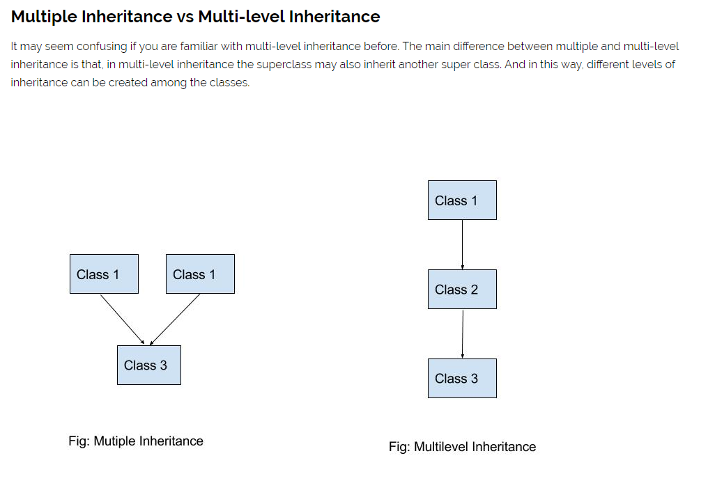

# Python Inheritance  
### python v3.7.3  

# Operations  

* Display methods from another class    


# Usage   
```
python index.py inheritance
```  

  

```
python index.py multilevel  
```  
```  
python index.py multiple  
```

# Usage for unit testing  
```  
python -m unittest tests/test_inheritance.py  
```  
```  
python -m unittest tests/test_multilevel_Inheritance.py  
```    
```
python -m unittest tests/test_multiple_Inheritance.py    
```  
